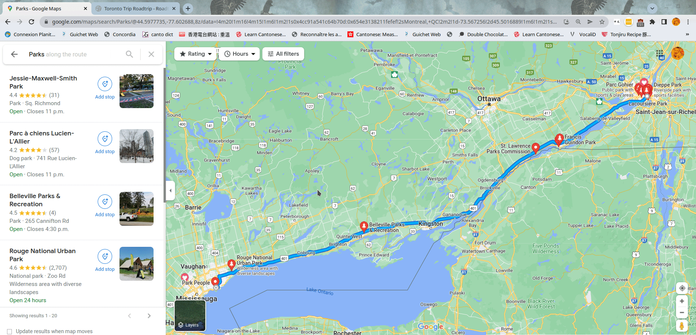
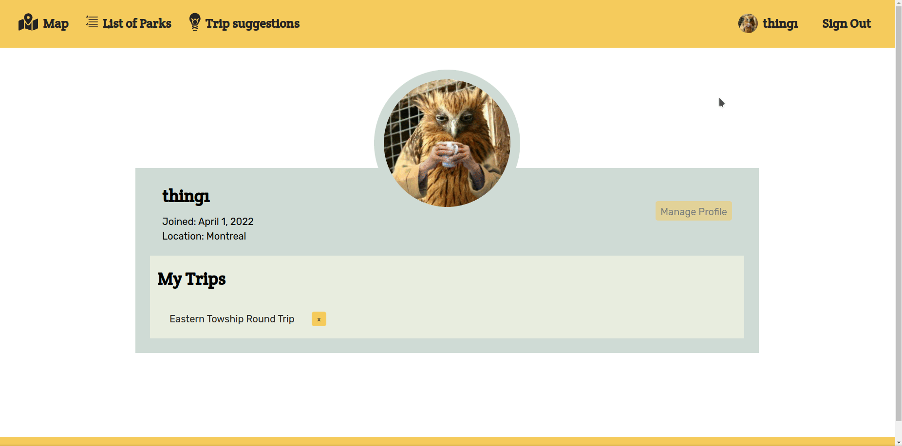
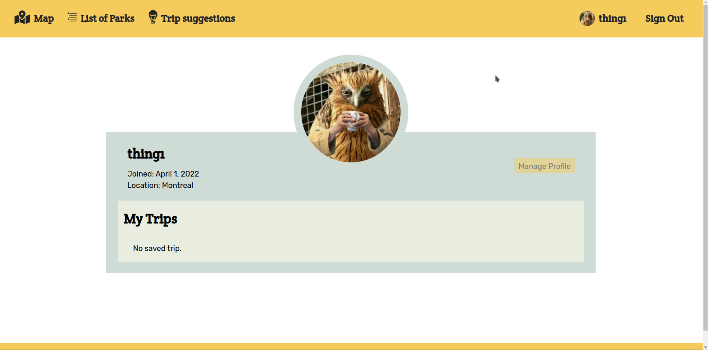

<h1> Canada Road Trip Planner</h1>
This is my full-stack Web Development course Final project to showcase my newly learned HTML, CSS, React, Node.js, Express, HTTP methods and MongoDB skills. 

<h2>Problems with current products</h2>
I love doing road trip visiting National and provincial parks but there is currently no product that allows an user to visually plan a road trip from start to finish without using another website. One can use Google Maps to generate the route from departure point to destination point then use the "Parks" filter to see parks along the route. However, there is no distinction between a community park vs National parks vs pronvicial parks, and barely any National/provincial parks are displayed. 

&nbsp;

There is also another product called RoadTrippers (https://roadtrippers.com/) that allows user to plan a road trip along a rendered route and it provides lots of waypoints. Unfortunately, there are almost no Canadian data. 

<h2>Solution: Canada Road Trip Planner</h2>
My product includes federal and provincial parks across Canada and allows user to render a route from an entered departure point and destination point, to add waypoints from park markers on the map which will render the new route accordingly and save the trip. This provides an overall visual planning process as well as a visual result. User can then manage their trips on the user page. 

<h3>Features before Sign In</h3>
Before signing in, the list of parks as well as the visual placement of the paks on the map are available but any other features are only available upon signed in. It is not possible to add a park as waypoint as the button is disabled and it is not possible to leave a review on a specific park. 

<h3>Trip Planning and Park Reviews</h3>
A singed in user can create a trip. The add button is still disabled as long as there are not departure and destination point. Route Rendering is also not possible. Removing the waypoint can be done with the button from the modal or on the waypoint lists. The route updates as waypoints changes which also modifies the driving metrics. 

&nbsp;

A signed in user can also leave a review of maximun 150 characters on a specific park. If there are already existing reviews, the newest review will be shown first.

<h3>Viewing a saved trip</h3>
The user is redirected to the trip details page once a trip is successfully saved. A trip can also be access from the user's page. The trip page provides driving metrics between stops as well as the total driving metrics, the route displayed on Google Map and the park waypoints are clickable links that bring the user to the park page. 

<h3>User page</h3>
User's saved trips can be deleted from this page. 

<h3>Other Features</h3>
There are plenty other possible features to enhance the product such as completing the current disabled features, adding filters for park display, adding pictures for UI purpose, adding private campgrounds data and other activities data, replacing Google Map API with a free tier map service so that I can deploy the web app without worrying about fees...There are plenty possibilities to increase the functionality of the product. 

<h3>Challenges</h3>
As I have to create a web app from scratch, I had to manage both the backend and the frontend. Here are some hurdles I encountered. 

1. Data Gathering
As there is not public API for Canada and provincial parks available, I had to manually scrap all the required data which allowed me to format them in a way that is easy to use but I did not have the time to gather data for ALL parks in Canada. Parks that are not accessible by driving are also omitted as to goal is to plan a road trip and it also avoid the problem of road that were not renderable. Data were saved in google sheet and the extension Export Sheet Data was used to export into JSON files then batch imported to MongoDB through a batch import fonction in my backend. 

2. Google Map API
Google Map documentation was very extensive and there example are in JavaScript but it cannot be used directly with React. There are several libraries to incorporate Google Map in React but only Google-Map-React has updated documentation yet it is not complete. There is also a very similarly named React-Google-Map library that was very much used previously so, lots of online examples are based off this library that has not been updated since 2018. Help was need from my bootcamp instructors and programer husband to understand and make this API work. 

<h2>Build With</h2>

-JavaScript

-CSS

-HTML

-React

-Node

-Express

-Google Map API (https://developers.google.com/maps)

-Google-Map_React (https://www.npmjs.com/package/google-map-react)

-react-router-hash-link https://www.npmjs.com/package/react-router-hash-link)

-React-Icon https://react-icons.github.io/react-icons)

-date-fns (https://date-fns.org/)

-moment.js (https://momentjs.com/)

<h2>Author</h2>
I'm a full stack web developer with a background in occupational therapist. I went from 0 coding knowledge to creating a whole web app in 2 weeks after 12 intense weeks of learning with Concordia Bootcamps. I plan on advincing my programming skills with learning TypeScript and SQL on the short term. I'm currently looking for my first opportunity to work as a frontend developer. Due to my background in therapy that was focused on enabling people to accomplish their desired taks in an independent and safe manner, it is a second nature for me to ensure that all products provide great usability with minimal to no pain points. 

<h2>Contribution</h2>
Specials thanks to the intructors at Concordia Bootcamp for their help as well as my husband who provided after class hour assistance.

<h2>Support</h2>
Contributions, issues, and feature requests are welcome!
